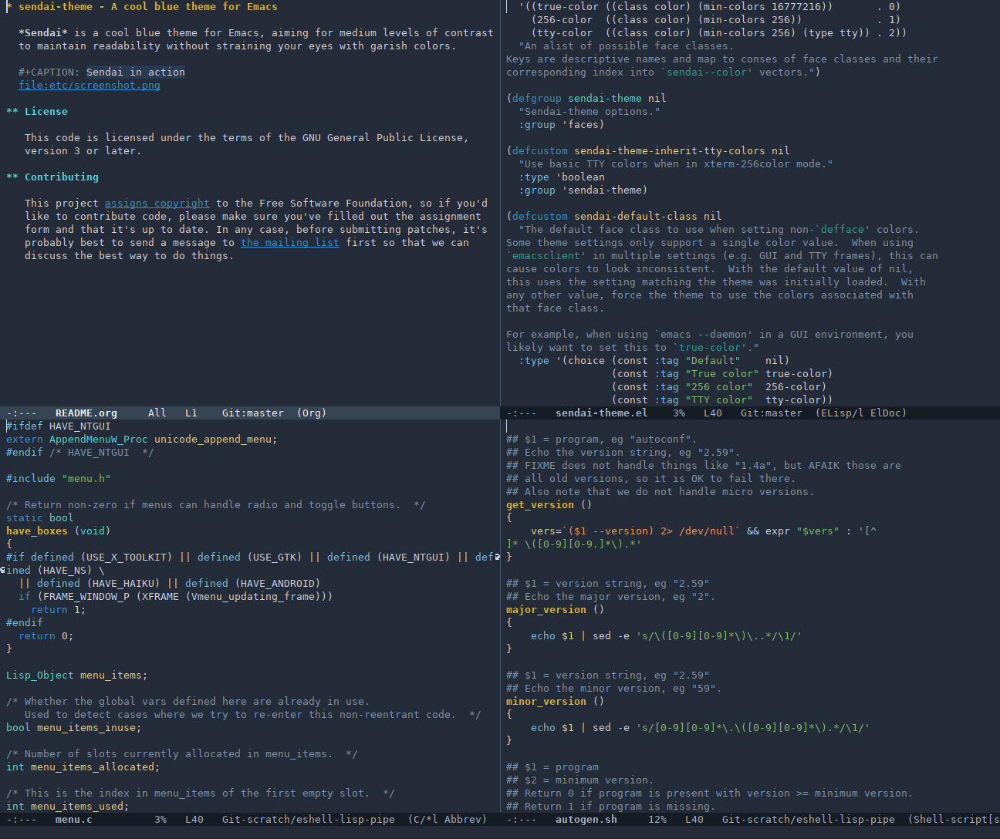

* sendai-theme - A cool blue theme for Emacs

  *Sendai* is a cool blue theme for Emacs, aiming for medium levels of contrast
  to maintain readability without straining your eyes with garish colors.

  #+CAPTION: Sendai in action
  

** Configuration

   Sendai endeavors to provide correct colors on both GUI and TTY frames via
   separate color definitions for basic TTYs, 256-color TTYs, and true-color
   (24-bit) displays. On 256-color TTYs, you can optionally use the 8 basic TTY
   color definitions (and their bright variants) where appropriate by enabling
   =sendai-inherit-tty-colors=. This is useful if you set your terminal
   emulator's theme to match Sendai's palette.

   If you use =emacsclient=, you may also want to set =sendai-default-class= to
   one of the color classes to prefer that class in cases where full =defface=
   specifications aren't supported (e.g. with =vc-annotate-color-map=).

** License

   This code is licensed under the terms of the GNU General Public License,
   version 3 or later.

** Contributing

   This project [[https://www.gnu.org/prep/maintain/html_node/Copyright-Papers.html][assigns copyright]] to the Free Software Foundation, so if you'd
   like to contribute code, please make sure you've filled out the assignment
   form and that it's up to date. In any case, before submitting patches, it's
   probably best to send a message to [[https://lists.sr.ht/~jimporter/sendai-theme-devel][the mailing list]] first so that we can
   discuss the best way to do things.
